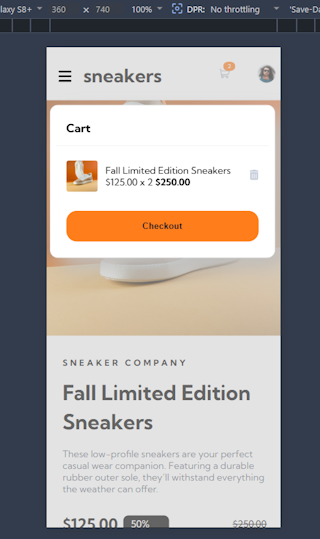
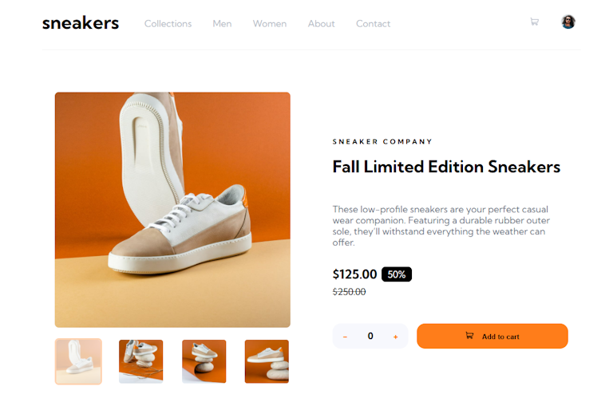

# E-commerce product page

This is my implementation of the
[E-commerce product page challenge on Frontend Mentor](https://www.frontendmentor.io/challenges/ecommerce-product-page-UPsZ9MJp6).
Frontend Mentor challenges help you improve your coding skills by building
realistic projects.

## Table of contents

- [Overview](#overview)
   - [Screenshot](#screenshot)
   - [Links](#links)
- [My process](#my-process)
   - [Built with](#built-with)
   - [What I learned](#what-i-learned)
   - [Continued development](#continued-development)
- [Author](#author)

## Overview

### Screenshot

#### Mobile view



#### Desktop view



### Links

- Solution URL: https://github.com/FJSolutions/fm-ecommerce-product-page/
- Live Site URL: https://fbj-ecommerce-product.netlify.app/

## My process

### Built with

- Semantic HTML5 markup
- CSS custom properties
- Flexbox
- CSS Grid
- Mobile-first workflow
- [Preact](https://preactjs.com/) - JS library
- [Valtio](https://valtio.dev/)
- [LightningCSS](https://lightningcss.dev/) - For styles

### What I learned

This was the first _big_ Frontend Mentor project I've done; and it took quite a
bit longer, not to mention other things that sidelined working on it. It was
also the most rewarding so far, especially managing the cart as popup, along
with the mobile menu and the floating lightbox. And for these reasons it was
also the most enjoyable so far.

Initially I tried using [`jotai`](https://jotai.org/) for state management, but
remembered when I had almost completed the stateful parts of the app, why I was
investigating other state managers: not having to have a page full of `useState`
hooks for individual pieces of state at the top of a component, having a
central place to also put the actions that affect the state (i.e. not directly
in the component), and not having to create providers to bubble state up through
child components (i.e. not tightly coupled to `react`). After going down a
rabbit while looking at Jack Herrington's series
on [Mastering Typescript State using Valtio](https://youtu.be/rWanEGMkXwc) on
YouTube, I eventually settled on Valtio becasue it fits my criteria best. So, I
reimplemented the state in Valtio - a process that was remarkable easy and
separated the state concern from the UI.

Despite using a couple of `<div>`s in this project it was remarkable how much I
was able to achieve with strictly semantic HTML.

```html
<h1>Some HTML code I'm proud of</h1>
```

The biggest `css` wins were in using LightningCSS' file imports to split the CSS
up more logically.

```css
@import "./root.css";
@import "./media.css";
@import "./nav.css";
@import "./lightbox.css";
@import "./sneaker-details.css";
```

For TypeScript it was elegantly simple to call a button's click event and handle
it with a strongly typed even that enabled me to prevent the event bubbling up
the DOM, and then pass the data-processing/business logic to the Valtio
`lightboxActions` object.

```ts
const handleNextImage = (e: TargetedMouseEvent<HTMLButtonElement>) => {
   e.stopPropagation()
   lightboxActions.nextImage()
}
```

### Continued development

The page will need to further development to be totally dynamic, not just for
handling dynamic records coming in from a backend, but also handling variable
number of images; and non-discounted products.

## Author

- Frontend
  Mentor - [Francis Judge](https://www.frontendmentor.io/profile/FJSolutions)
